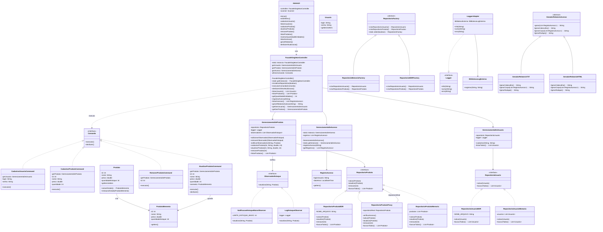

# Diagrama de Classes — Floricultura

```mermaid
classDiagram
    direction TB

    %% ════════════════════════════════════════════════
    %% FRONTEIRA (UI)
    %% ════════════════════════════════════════════════
    class AdminUI {
        -controller: FacadeSingletonController
        -scanner: Scanner
        +iniciar()
        -exibirMenu()
        -cadastrarUsuario()
        -listarUsuarios()
        -cadastrarProduto()
        -atualizarProduto()
        -removerProduto()
        -listarProdutos()
        -mostrarQuantidadeEntidades()
        -listarAcessos()
        -gerarRelatorio()
        -desfazerAtualizacao()
    }

    %% ════════════════════════════════════════════════
    %% CONTROLE
    %% ════════════════════════════════════════════════
    class FacadeSingletonController {
        -static instancia: FacadeSingletonController
        -gerUsuario: GerenciamentoDeUsuario
        -gerProduto: GerenciamentoDeProduto
        -gerAcesso: GerenciamentoDeAcesso
        -ultimoComando: Comando
        -FacadeSingletonController()
        +static getInstance(): FacadeSingletonController
        +inicializarRepositorios(boolean)
        +executarComando(Comando)
        +desfazerUltimaAtualizacao()
        +listarUsuario(): List~Usuario~
        +listarProdutos(): List~Produto~
        +getQuantidadeEntidades(): int
        +registrarAcesso(String)
        +listarAcessos(): List~RegistroAcesso~
        +gerarRelatorioAcessos(String): String
        +getGerUsuario(): GerenciamentoDeUsuario
        +getGerProduto(): GerenciamentoDeProduto
    }

    class GerenciamentoDeUsuario {
        -repositorio: RepositorioUsuario
        -logger: Logger
        +cadastrar(String, String)
        +listarTodos(): List~Usuario~
    }

    class GerenciamentoDeProduto {
        -repositorio: RepositorioProduto
        -logger: Logger
        -observadores: List~ObservadorEstoque~
        +adicionarObservador(ObservadorEstoque)
        +removerObservador(ObservadorEstoque)
        -notificarObservadores(String, Produto)
        +cadastrarProduto(int, String, double, int)
        +atualizarProduto(int, String, double, int)
        +removerProduto(int)
        +listarProdutos(): List~Produto~
    }

    class GerenciamentoDeAcesso {
        -static instancia: GerenciamentoDeAcesso
        -registros: List~RegistroAcesso~
        -GerenciamentoDeAcesso()
        +static getInstance(): GerenciamentoDeAcesso
        +registrarAcesso(String)
        +getRegistros(): List~RegistroAcesso~
    }

    %% ════════════════════════════════════════════════
    %% COMMAND
    %% ════════════════════════════════════════════════
    class Comando {
        <<interface>>
        +executar()
        +desfazer()
    }

    class CadastrarUsuarioCommand {
        -gerUsuario: GerenciamentoDeUsuario
        -login: String
        -senha: String
        +executar()
    }

    class CadastrarProdutoCommand {
        -gerProduto: GerenciamentoDeProduto
        -id: int
        -nome: String
        -preco: double
        -quantidade: int
        +executar()
    }

    class AtualizarProdutoCommand {
        -gerProduto: GerenciamentoDeProduto
        -id: int
        -nome: String
        -preco: double
        -quantidade: int
        -memento: ProdutoMemento
        +executar()
        +desfazer()
    }

    class RemoverProdutoCommand {
        -gerProduto: GerenciamentoDeProduto
        -id: int
        +executar()
    }

    %% ════════════════════════════════════════════════
    %% OBSERVER
    %% ════════════════════════════════════════════════
    class ObservadorEstoque {
        <<interface>>
        +atualizar(String, Produto)
    }

    class LogEstoqueObserver {
        -logger: Logger
        +atualizar(String, Produto)
    }

    class NotificacaoEstoqueBaixoObserver {
        -LIMITE_ESTOQUE_BAIXO: int
        +atualizar(String, Produto)
    }

    %% ════════════════════════════════════════════════
    %% ENTIDADE
    %% ════════════════════════════════════════════════
    class Usuario {
        -login: String
        -senha: String
        +getters/setters
    }

    class Produto {
        -id: int
        -nome: String
        -preco: double
        -quantidadeEstoque: int
        +getters/setters
        +salvarEstado(): ProdutoMemento
        +restaurarEstado(ProdutoMemento)
    }

    class ProdutoMemento {
        -id: int
        -nome: String
        -preco: double
        -quantidadeEstoque: int
        +getters()
    }

    class RegistroAcesso {
        -loginUsuario: String
        -dataHora: LocalDateTime
        +getters()
    }

    %% ════════════════════════════════════════════════
    %% REPOSITÓRIO (inclui Proxy e Factory)
    %% ════════════════════════════════════════════════
    class RepositorioUsuario {
        <<interface>>
        +salvar(Usuario)
        +buscarTodos(): List~Usuario~
    }

    class RepositorioProduto {
        <<interface>>
        +salvar(Produto)
        +atualizar(Produto)
        +remover(int)
        +buscarTodos(): List~Produto~
    }

    class RepositorioProdutoProxy {
        -repositorioReal: RepositorioProduto
        -verificarAcesso()
        +salvar(Produto)
        +atualizar(Produto)
        +remover(int)
        +buscarTodos(): List~Produto~
    }

    class RepositorioUsuarioMemoria {
        -usuarios: List~Usuario~
        +salvar(Usuario)
        +buscarTodos(): List~Usuario~
    }

    class RepositorioUsuarioBDR {
        -NOME_ARQUIVO: String
        +salvar(Usuario)
        +buscarTodos(): List~Usuario~
    }

    class RepositorioProdutoMemoria {
        -produtos: List~Produto~
        +salvar(Produto)
        +atualizar(Produto)
        +remover(int)
        +buscarTodos(): List~Produto~
    }

    class RepositorioProdutoBDR {
        -NOME_ARQUIVO: String
        +salvar(Produto)
        +atualizar(Produto)
        +remover(int)
        +buscarTodos(): List~Produto~
    }

    class RepositorioFactory {
        <<abstract>>
        +criarRepositorioUsuario(): RepositorioUsuario*
        +criarRepositorioProduto(): RepositorioProduto*
        +static obter(boolean): RepositorioFactory
    }

    class RepositorioMemoriaFactory {
        +criarRepositorioUsuario(): RepositorioUsuario
        +criarRepositorioProduto(): RepositorioProduto
    }

    class RepositorioBDRFactory {
        +criarRepositorioUsuario(): RepositorioUsuario
        +criarRepositorioProduto(): RepositorioProduto
    }

    %% ════════════════════════════════════════════════
    %% LOG (Adapter)
    %% ════════════════════════════════════════════════
    class Logger {
        <<interface>>
        +info(String)
        +aviso(String)
        +erro(String)
    }

    class LoggerAdapter {
        -bibliotecaExterna: BibliotecaLogExterna
        +info(String)
        +aviso(String)
        +erro(String)
    }

    class BibliotecaLogExterna {
        +registrar(String, String)
    }

    %% ════════════════════════════════════════════════
    %% RELATÓRIO (Template Method)
    %% ════════════════════════════════════════════════
    class GeradorRelatorioAcesso {
        <<abstract>>
        +gerar(List~RegistroAcesso~): String
        #gerarCabecalho(): String*
        #gerarCorpo(List~RegistroAcesso~): String*
        #gerarRodape(): String*
    }

    class GeradorRelatorioTXT {
        #gerarCabecalho(): String
        #gerarCorpo(List~RegistroAcesso~): String
        #gerarRodape(): String
    }

    class GeradorRelatorioHTML {
        #gerarCabecalho(): String
        #gerarCorpo(List~RegistroAcesso~): String
        #gerarRodape(): String
    }

    %% ════════════════════════════════════════════════
    %% RELACIONAMENTOS
    %% ════════════════════════════════════════════════

    %% Fronteira -> Controle
    AdminUI ..> FacadeSingletonController : usa

    %% Facade -> Gerenciamentos
    FacadeSingletonController --> GerenciamentoDeUsuario
    FacadeSingletonController --> GerenciamentoDeProduto
    FacadeSingletonController --> GerenciamentoDeAcesso

    %% Gerenciamento -> Repositório (interfaces)
    GerenciamentoDeUsuario --> RepositorioUsuario
    GerenciamentoDeProduto --> RepositorioProduto

    %% Observer: Subject -> Observer
    GerenciamentoDeProduto --> ObservadorEstoque : notifica
    ObservadorEstoque <|.. LogEstoqueObserver
    ObservadorEstoque <|.. NotificacaoEstoqueBaixoObserver

    %% Proxy: implementa interface e delega ao real
    RepositorioProduto <|.. RepositorioProdutoProxy
    RepositorioProdutoProxy --> RepositorioProduto : repositorioReal

    %% Repositório: interface -> implementações
    RepositorioUsuario <|.. RepositorioUsuarioMemoria
    RepositorioUsuario <|.. RepositorioUsuarioBDR
    RepositorioProduto <|.. RepositorioProdutoMemoria
    RepositorioProduto <|.. RepositorioProdutoBDR

    %% Factory
    RepositorioFactory <|-- RepositorioMemoriaFactory
    RepositorioFactory <|-- RepositorioBDRFactory

    %% Command
    Comando <|.. CadastrarUsuarioCommand
    Comando <|.. CadastrarProdutoCommand
    Comando <|.. AtualizarProdutoCommand
    Comando <|.. RemoverProdutoCommand
    FacadeSingletonController ..> Comando : executa

    %% Memento
    Produto --> ProdutoMemento : cria
    AtualizarProdutoCommand --> ProdutoMemento : guarda

    %% Adapter
    LoggerAdapter ..|> Logger
    LoggerAdapter --> BibliotecaLogExterna

    %% Template Method
    GeradorRelatorioAcesso <|-- GeradorRelatorioTXT
    GeradorRelatorioAcesso <|-- GeradorRelatorioHTML

    %% Entidades
    GerenciamentoDeAcesso --> RegistroAcesso
```
